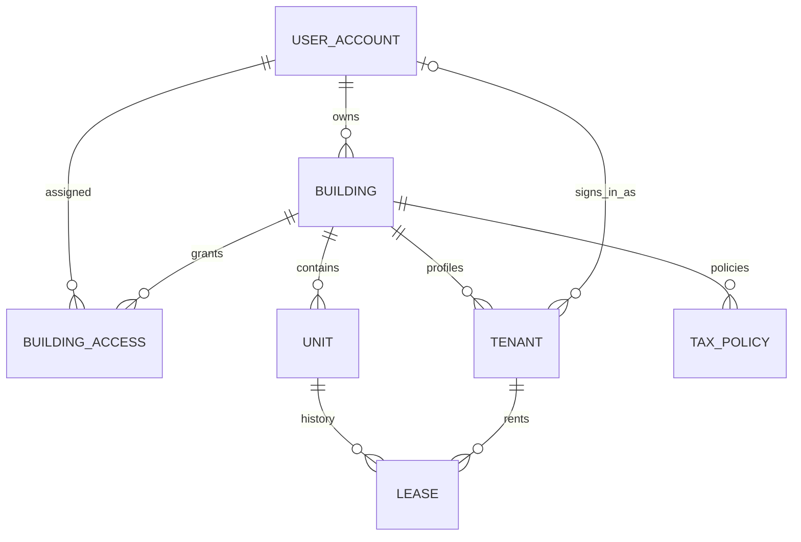
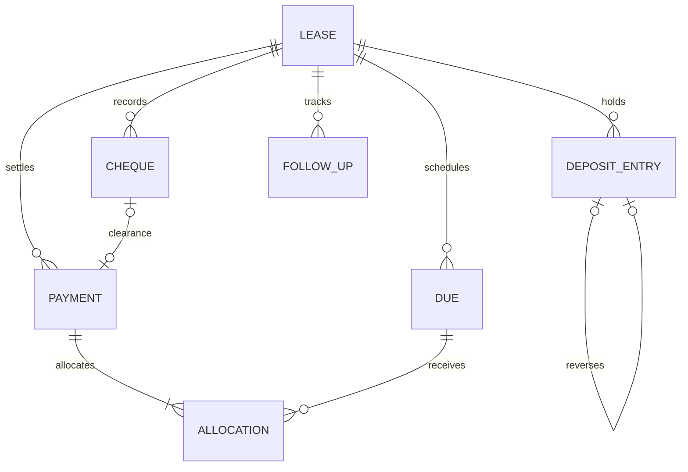
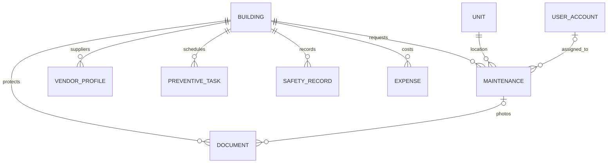
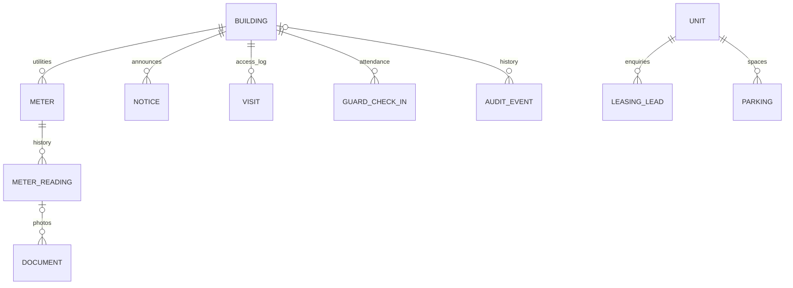

# Architecture and engineering decisions

Bayt is a same-origin modular monolith: vanilla ES modules call Spring MVC JSON APIs; Spring Security protects session requests; Spring Data JPA and Hibernate persist to MySQL; Flyway owns schema changes. No application data is stored in browser storage. Session storage contains only the display-language preference.

## Repository guide

Base package: `com.codevictims.propertymanagement`. Entry point: `PropertyManagementApplication`.

| Feature | Responsibility |
|---|---|
| `account` | User accounts, authentication endpoints and building assignments |
| `security` | Session/CSRF configuration and ownership/assignment authorization |
| `property` | Buildings, units, safety, meters, announcements and guard operations |
| `tenancy` | Tenant profiles, lease lifecycle, leads and viewings |
| `billing` | Dues, payments, allocations, cheques, deposits, expenses and tax policies |
| `maintenance` | Work orders, vendor profiles, preventive tasks and optional AI |
| `dashboard` | Reports and reminders |
| `common` | Base entity, exceptions, shared DTO support, audit and protected files |

Each domain keeps its `entity`, `repository`, `service`, `controller`, `dto/request`, `dto/response` and `mapper` classes together where applicable. Controllers validate editable request DTOs and map responses explicitly. Password hashes and storage keys never appear in response DTOs. Services retain transaction and permission rules; repositories contain typed Spring Data queries. `PersistenceSupport` centralizes managed-entity access and the refreshed pessimistic lock required by financial concurrency tests. Operations share a service because their building-level authorization rules are common.

Resources follow standard Spring Boot conventions: `application*.yml`, `db/migration`, `prompts/maintenance-assistant.txt`, and `static/{css,js,i18n,assets}`. The existing HTML entry page remains `static/index.html`. The test profile is `src/test/resources/application-test.yml`; cross-feature MySQL regressions live under the security test package, with finance and AI unit tests in their feature packages. No empty test scaffolding is required.

The package refactor does not change entity table names, applied Flyway migrations, public endpoint paths or monetary rules.

## Entity relationships

The diagrams are intentionally split for readability. All identifiers are generated BIGINT primary keys; schema files contain the complete fields, indexes and foreign keys.

## Authorization

Every entity read, write, report and download derives access from the authenticated account. Request bodies cannot assign owner IDs. The platform administrator manages owner/platform accounts without permission to inspect portfolios, documents or financial records.

Owners create manager, tenant, vendor and guard accounts for their portfolio. Managers receive per-building read or write grants. Tenants are linked to tenant profiles and can read their own tenancy records; vendor access is limited to assigned work orders and their photos; guards see assigned-building visitor/check-in/parking operations. Account-to-building relationships are validated when creating dependent records. Generic operation routes use an explicit allowlist of entity types and field-by-field input extraction.

## Financial consistency

The lease row is the mutex for payments, cheque clearance, deposit movements and reversals. Services acquire a pessimistic write lock before examining balances. Lease creation locks the unit before checking date overlap. Locks and all related inserts run inside the same READ_COMMITTED transaction. This is essential: MySQL REPEATABLE_READ can retain a pre-lock authorization snapshot and miss the first writer's committed allocations. Rows already loaded by authorization are refreshed under their write lock. MySQL integration tests exercise simultaneous clearances and competing payments.

Payment allocations are immutable. A reversal stores its effective date/reason on the payment and appends an audit event; allocation records remain available for historical balances. A bounced, cancelled or merely deposited cheque has no payment. A unique linked payment and deterministic cheque idempotency key prevent duplicate clearance. A reversed cleared cheque cannot be cleared again; record a new payment or replacement cheque through the documented correction flow.

Dates on new financial entries cannot predate the latest event on that lease/ledger. This intentionally conservative rule avoids allocating a newly backdated payment over amounts that were still settled at the earlier date. Historical migration/backfill requires a reviewed import process; the interactive UI is not an accounting import tool.

All monetary storage uses DECIMAL(15,3) / BigDecimal. Rates use DECIMAL(7,4); amounts cannot have sub-baisa precision. Rent-tax snapshots and due amounts are retained even if owner tax status subsequently changes.

## Explicit scope decisions

- One unit and one tenant/company per lease; fixed rent; 1–60 full monthly periods; no proration, rent escalation, co-tenancy or automatic credits. Due dates are `start.plusMonths(n)`; the lease ends `start.plusMonths(months).minusDays(1)`.
- Termination keeps the current started monthly period due in full. Future periods are cancelled after any allocated payments have been reversed. Audit history records the reason. A renewal creates a separate linked lease.
- Floors are named unit groups (`floorName`), not separately permissioned objects.
- Tax policies are explicitly selected and must cover the full lease term. They are never inferred from residential/commercial labels. Exempt, zero-rated and out-of-scope treatments are distinct. Actual Omani tax treatment and legal contract wording require confirmation by the operator's advisers; no legal certification is claimed.
- Reminders are live in-app records computed from stored dates. No email, WhatsApp, gateway or physical-device side effects are simulated.
- Documents and lease drafts download as protected files / standalone printable HTML. The browser can print draft HTML to PDF. There is no electronic signature or municipal filing integration.
- Search and pagination are applied after authorization within the service response. For large portfolios, move list filtering/pagination and aggregates into dedicated indexed database queries; this implementation prioritizes a clear training-team codebase. Relationship selectors load all authorized pages; very large portfolios should use server-side autocomplete.
- Dates are displayed in Asia/Muscat, UTC is used for stored timestamps, and amounts display three decimal places.

## Dependency references

Pinned versions are in `pom.xml`, the wrapper properties, Compose and the browser test lockfile. The compiler release is explicitly 17 to prevent the obsolete-target error.

- Spring Boot 3.5.16 Java/Maven requirements: https://docs.spring.io/spring-boot/3.5/system-requirements.html
- Spring AI 1.1.x / Boot 3.5.x compatibility: https://github.com/spring-projects/spring-ai#readme
- Spring AI 1.1.8 release: https://github.com/spring-projects/spring-ai/releases/tag/v1.1.8
- Maven Wrapper source (Apache licensed scripts): https://github.com/apache/maven-wrapper/tree/maven-wrapper-3.3.4

Reassess upstream security patches before a production deployment. The selected versions are pinned for reproducibility, not a promise of indefinite support.
